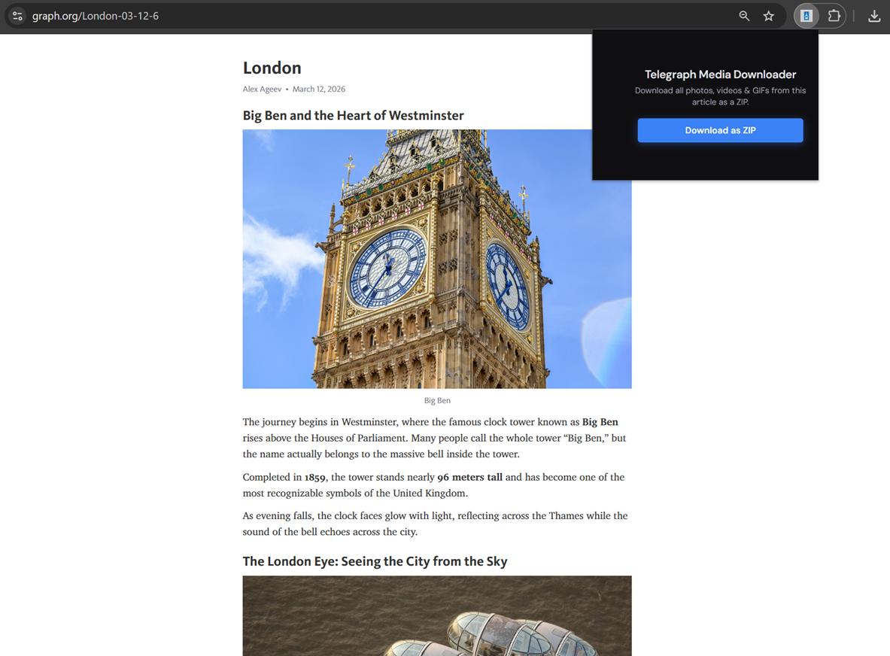

# Telegraph Media Downloader

Save any Telegraph article (telegra.ph / graph.org) as media, PDF, or Markdown — one click, no login.



---

## What you can do

| Action | Result |
|--------|--------|
| **Download Media** | All images, videos & GIFs in one ZIP |
| **Export as PDF** | Single PDF with text, images and captions |
| **Export as Markdown** | ZIP with `article.md` + `media/` folder (works offline) |

Open a Telegraph page → click the extension → pick an option.

---

## Install

**Option A — Direct download**

1. [**Download the extension ZIP**](https://github.com/alex-ageev/telegraph-media-downloader/raw/main/zip/telegraph-media-downloader-1.0.0.zip)
2. Unzip it
3. In Chrome go to `chrome://extensions/` → turn on **Developer mode** → **Load unpacked** → choose the unzipped folder

**Option B — Build yourself**

```bash
npm install
npm run build
```

Then load the `build` folder the same way (Load unpacked).

Works in Chrome, Edge, Brave, Arc.

---

## How to use

1. Open a Telegraph article (`telegra.ph` or `graph.org`)
2. Click the extension icon
3. Click **Download Media**, **Export as PDF**, or **Export as Markdown**

Files are named from the article title (e.g. `my-article.zip`, `my-article.pdf`).

---

## License

MIT · Star the repo if you find it useful.
